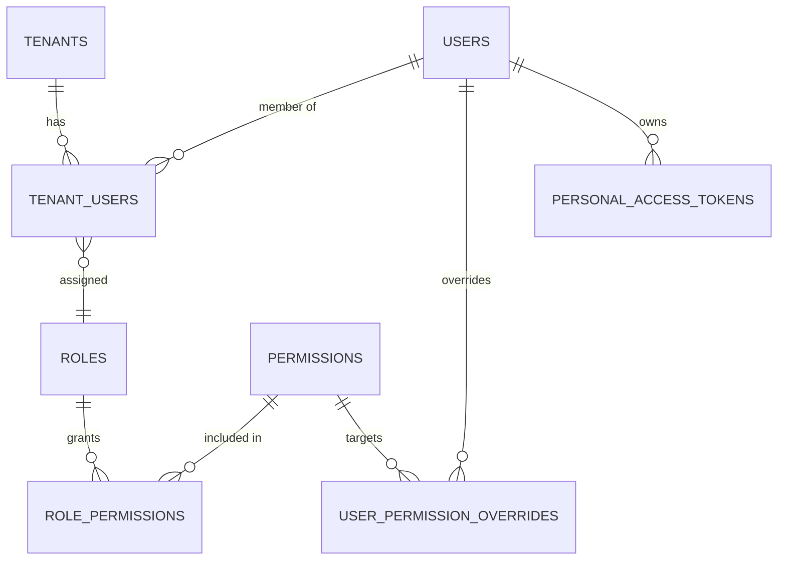
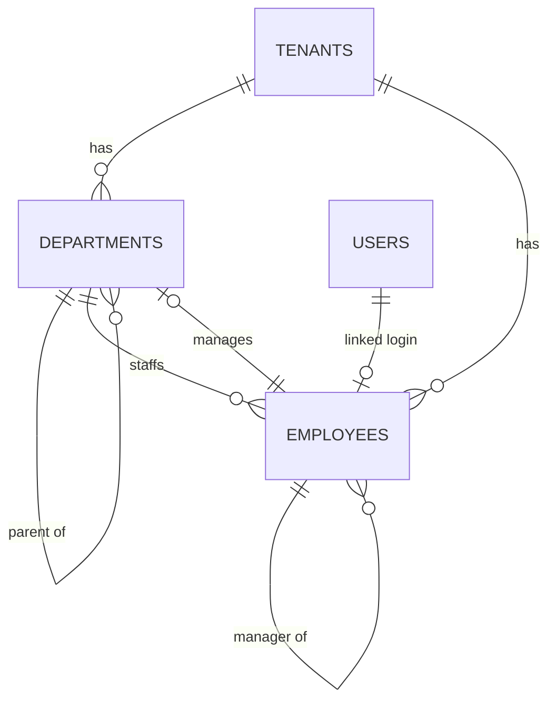
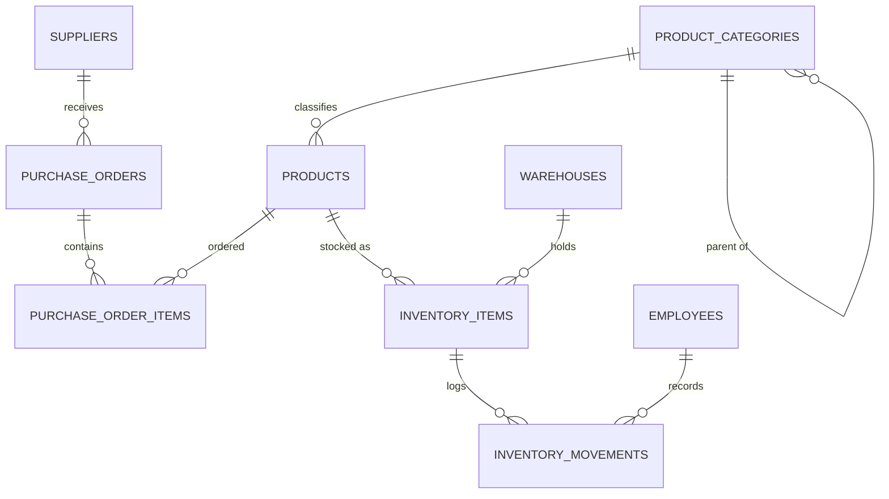
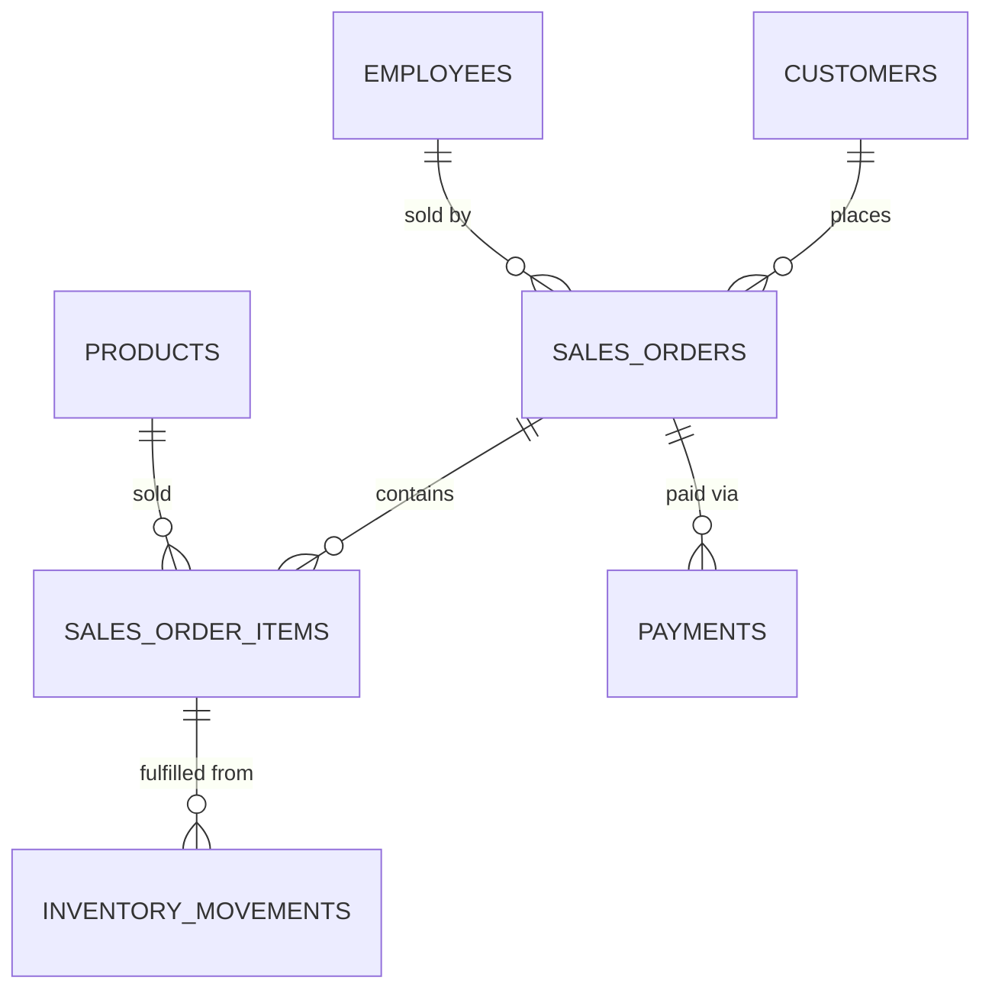
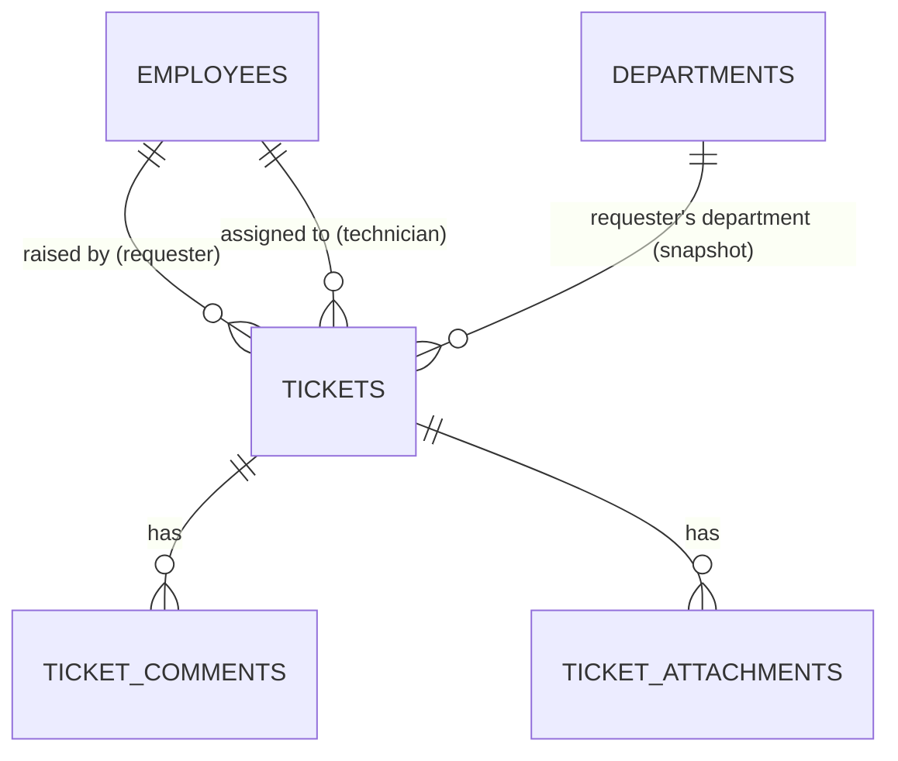
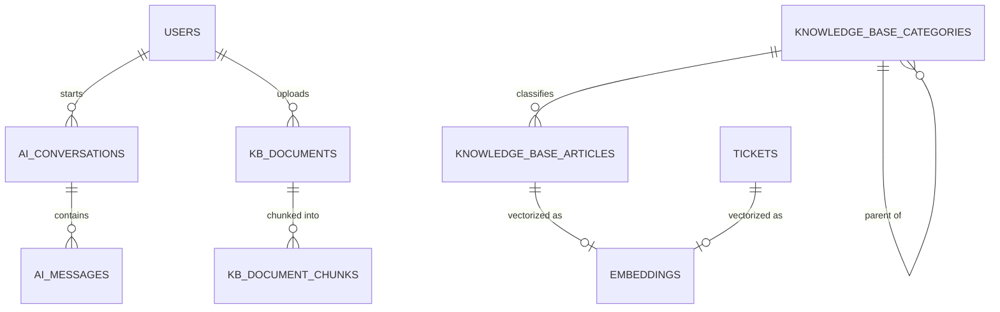
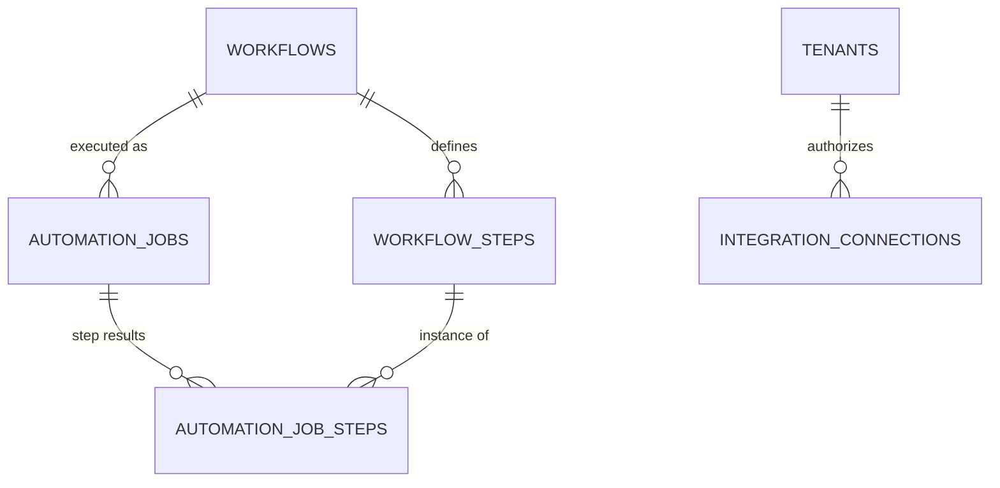
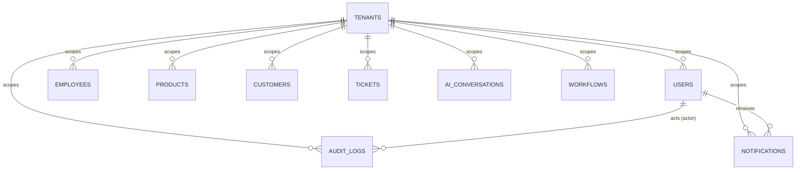

# Database Design

Status: Draft v2.0 — proposed target model, **no migrations written**.
Per project rules, actual schema changes require explicit approval before
any migration is authored from this document.

Related: [ARCHITECTURE.md](ARCHITECTURE.md) · [API.md](API.md)

## 1. Engine & Conventions

**PostgreSQL 16+**, extensions: `pgcrypto` (ULID/UUID generation),
`vector` (pgvector, for embeddings), `pg_trgm` (fuzzy search on
tickets/knowledge base/products).

| Convention | Rule |
|---|---|
| Primary keys | ULID, `char(26)`, application/DB-generated, sortable by creation time. Never auto-increment integers — safe to expose in the API, collision-safe across distributed writers. |
| Multi-tenancy | Every tenant-owned table has `tenant_id char(26) NOT NULL REFERENCES tenants(id)`, enforced by a global application-level scope. Composite index `(tenant_id, id)` on every such table. |
| Timestamps | `created_at`, `updated_at` (`timestamptz`) on every table. `deleted_at` (soft delete) on user/business-facing entities where recovery matters; hard delete only for transient/ledger-append data. |
| Enums | Modeled as `text` + `CHECK (col IN (...))`, not native Postgres `ENUM` — adding a value to a `CHECK` list is a cheap migration; altering a native enum type is not. |
| JSONB | Reserved for genuinely variable-shape data (workflow step config, audit diff payloads) — never used to avoid modeling a real relationship. |
| Money | `numeric(14,2)` with an explicit `currency char(3)` column, never `float`. |
| Naming | `snake_case`, plural table names, FK columns named `<singular_table>_id`. |
| Referential integrity | Declared at the DB level via `FOREIGN KEY`, never relied on application code alone. |

## 2. Domain Map

| # | Domain | Tables |
|---|---|---|
| 1 | Identity & RBAC | `tenants`, `users`, `tenant_users`, `roles`, `permissions`, `role_permissions`, `user_permission_overrides`, `personal_access_tokens` |
| 2 | Departments & Employees | `departments`, `positions`, `employees`, `employee_notes`, `employee_id_sequences` |
| 3 | Suppliers & Inventory | `suppliers`, `product_categories`, `products`, `warehouses`, `inventory_items`, `inventory_movements`, `purchase_orders`, `purchase_order_items` |
| 4 | Sales | `customers`, `sales_orders`, `sales_order_items`, `payments` |
| 5 | Tickets | `ticket_id_sequences`, `tickets`, `ticket_comments`, `ticket_attachments` |
| 6 | Files | `files` |
| 7 | Audit & Notifications | `audit_logs`, `notifications` |
| 8 | AI, Knowledge Base & Embeddings | **Built:** `ai_conversations`, `ai_messages` (AI Assistant module); `kb_documents`, `kb_document_chunks` (Knowledge Base module). **Still unimplemented:** `knowledge_base_categories`, `knowledge_base_articles`, `embeddings` |
| 9 | Automation | **Built:** `workflows`, `workflow_steps`, `automation_jobs`, `automation_job_steps` (Automation Engine module). **Still unimplemented:** `integration_connections` (no webhooks/OAuth integrations this round) |

41 tables total. Multi-tenant on all except `permissions` (global system
permission catalogue) and system-level `roles` (`tenant_id IS NULL`).

## 3. Entity-Relationship Diagrams

### 3.1 Identity & RBAC

### 3.2 Departments & Employees

### 3.3 Suppliers & Inventory

### 3.4 Sales

### 3.5 Tickets

**As built** (IT Ticketing module) — this section originally sketched a
customer-support model (`ticket_categories`, an exclusive
customer-or-user requester, SLA-only `sla_due_at`). The as-built IT
Ticketing module is internal-only: every ticket is raised by an
`employee` and (optionally) resolved by another `employee` acting as
technician; `type` is a fixed `CHECK` list rather than a `ticket_categories`
table (see §4.5); attachments are self-contained rather than backed by
`files` (see §4.6); and a `ticket_id_sequences` table (mirroring
`employee_id_sequences`) backs system-generated `ticket_number` values.

### 3.6 AI, Knowledge Base & Embeddings

**As built** (AI Assistant + Knowledge Base modules) — `ai_conversations`/
`ai_messages` exist (`ai_messages.role` gained a fourth value the original
sketch didn't have — `tool`, for function-calling results — alongside
`tool_calls`/`tool_call_id`/`name` columns, see §4.8). The Knowledge Base
module built `kb_documents`/`kb_document_chunks` — a PDF-upload-and-RAG
pipeline (upload → extract → chunk → embed → retrieve → cite → answer),
**not** the `knowledge_base_categories`/`knowledge_base_articles` sketched
below (a separate, still-unbuilt concept: manually-authored wiki-style
articles). `kb_document_chunks.embedding` is a jsonb array of floats, not
a native pgvector column — see §4.8's note for why. `knowledge_base_*` and
`embeddings` remain **unimplemented**.

`embeddings` is polymorphic (`embeddable_type` + `embeddable_id`) so any
searchable entity — KB article, ticket, product — can be embedded for
semantic search without a dedicated vector column on each source table.
Still just a design, per the note above; `kb_document_chunks` took the
simpler jsonb-column route instead, deliberately, for this module.

### 3.7 Automation

**As built** (Automation Engine module) — `workflows`, `workflow_steps`,
`automation_jobs`, and `automation_job_steps` are the real, shipped
schema (see §4.9 for what changed from the sketch below).
`integration_connections` remains **unimplemented** — no webhooks or
OAuth-based integrations this round, so `workflows` triggers are limited
to the domain events this codebase already fires (Ticketing, Employee
Management) plus cron schedules, not third-party webhooks.

### 3.8 High-Level Cross-Domain View

Every domain table also carries a `tenant_id` FK back to `TENANTS`; that
fan-out is omitted from the per-domain diagrams above for readability and
shown once here.

## 4. Table Catalogue

Column notation: `name : type` — `PK` primary key, `FK→table` foreign key,
`UQ` unique, `NN` not null (all PKs/FKs are `NN` by default, omitted for
brevity), `IDX` indexed beyond the FK/PK default.

### 4.1 Identity & RBAC

**`tenants`**
| Column | Type | Notes |
|---|---|---|
| id | char(26) | PK |
| name | text | |
| slug | text | UQ |
| plan | text | CHECK IN (free, pro, enterprise) |
| settings | jsonb | tenant-level config |
| created_at / updated_at / deleted_at | timestamptz | |

**`users`** — platform login identities (not tenant-scoped; a user can join multiple tenants)
| Column | Type | Notes |
|---|---|---|
| id | char(26) | PK |
| email | citext | UQ |
| password_hash | text | |
| name | text | |
| email_verified_at | timestamptz | nullable |
| created_at / updated_at / deleted_at | timestamptz | |

**`tenant_users`** — membership + role (pivot)
| Column | Type | Notes |
|---|---|---|
| id | char(26) | PK |
| tenant_id | char(26) | FK→tenants |
| user_id | char(26) | FK→users |
| role_id | char(26) | FK→roles |
| status | text | CHECK IN (invited, active, suspended) |
| created_at / updated_at | timestamptz | |
| | | UQ (tenant_id, user_id) |

**`roles`**
| Column | Type | Notes |
|---|---|---|
| id | char(26) | PK |
| tenant_id | char(26) | FK→tenants, **nullable** = system role (Owner/Admin/Member templates) |
| name | text | |
| is_system | boolean | default false |
| created_at / updated_at | timestamptz | |
| | | UQ (tenant_id, name) |

**`permissions`** — global catalogue, not tenant-scoped
| Column | Type | Notes |
|---|---|---|
| id | char(26) | PK |
| key | text | UQ, e.g. `workflows:write` |
| description | text | |

**`role_permissions`**
| Column | Type | Notes |
|---|---|---|
| role_id | char(26) | FK→roles |
| permission_id | char(26) | FK→permissions |
| | | composite PK (role_id, permission_id) |

**`user_permission_overrides`** — per-user grant/deny beyond their role
| Column | Type | Notes |
|---|---|---|
| id | char(26) | PK |
| tenant_id | char(26) | FK→tenants |
| user_id | char(26) | FK→users |
| permission_id | char(26) | FK→permissions |
| effect | text | CHECK IN (grant, deny) |
| created_at | timestamptz | |
| | | UQ (tenant_id, user_id, permission_id) |

**`personal_access_tokens`**
| Column | Type | Notes |
|---|---|---|
| id | char(26) | PK |
| tenant_id | char(26) | FK→tenants |
| user_id | char(26) | FK→users |
| name | text | |
| token_hash | text | UQ |
| abilities | jsonb | ability list, e.g. `["workflows:read"]` |
| last_used_at / expires_at | timestamptz | nullable |
| created_at | timestamptz | |

### 4.2 Departments & Employees

**As built** (Employee Management module) — this section originally sketched
`departments`/`employees` only; the implementation added `positions` as its
own entity (rather than a free-text `job_title` on `employees`), an
`employee_notes` table, and an `employee_id_sequences` table backing
atomic, per-tenant `employee_number` generation. Compensation/payroll
fields remain intentionally excluded, as originally noted — if added later
they belong in a restricted table with column-level encryption and a
dedicated Policy, not on the general `employees` row.

**`departments`**
| Column | Type | Notes |
|---|---|---|
| id | char(26) | PK |
| tenant_id | char(26) | FK→tenants |
| name | text | |
| description | text | nullable |
| parent_department_id | char(26) | FK→departments, nullable (hierarchy) |
| manager_employee_id | char(26) | FK→employees, **nullable, added post-creation** (see §7 circular FK) |
| created_at / updated_at / deleted_at | timestamptz | |
| | | UQ (tenant_id, parent_department_id, name) |

**`positions`**
| Column | Type | Notes |
|---|---|---|
| id | char(26) | PK |
| tenant_id | char(26) | FK→tenants |
| title | text | |
| description | text | nullable |
| created_at / updated_at / deleted_at | timestamptz | |
| | | UQ (tenant_id, title) |

**`employee_id_sequences`** — internal, not exposed via the API
| Column | Type | Notes |
|---|---|---|
| tenant_id | char(26) | PK, FK→tenants |
| next_number | integer | default 1, incremented under `SELECT ... FOR UPDATE` |

**`employees`**
| Column | Type | Notes |
|---|---|---|
| id | char(26) | PK |
| tenant_id | char(26) | FK→tenants |
| user_id | char(26) | FK→users, nullable (not every employee has platform login) |
| employee_number | text | system-generated (`EMP-000123`), never client-writable, UQ per tenant |
| first_name / last_name | text | |
| email | citext | nullable, UQ per tenant when present — the employee's work contact address, distinct from `users.email` (login identity) |
| phone | text | nullable |
| department_id | char(26) | FK→departments, nullable |
| position_id | char(26) | FK→positions, nullable |
| manager_employee_id | char(26) | FK→employees, nullable (self-referential org chart); a record may not reference itself |
| employment_type | text | CHECK IN (full_time, part_time, contractor, intern) |
| employment_status | text | CHECK IN (active, on_leave, suspended, terminated) |
| hire_date | date | |
| termination_date | date | nullable |
| address | jsonb | nullable, mailing address |
| emergency_contact | jsonb | nullable — `{name, relationship, phone, email}` |
| avatar_path | text | nullable, storage-disk path (profile picture) |
| bio | text | nullable |
| created_at / updated_at / deleted_at | timestamptz | |
| | | UQ (tenant_id, employee_number), UQ (tenant_id, email) |

**`employee_notes`**
| Column | Type | Notes |
|---|---|---|
| id | char(26) | PK |
| tenant_id | char(26) | FK→tenants |
| employee_id | char(26) | FK→employees, cascade on delete |
| author_user_id | char(26) | FK→users, nullable |
| note | text | |
| created_at | timestamptz | append-only, no `updated_at` |

Audit trail entries for this domain (`employee.created`, `.updated`,
`.archived`, `.department_changed`, `.position_changed`,
`.manager_changed`, `.status_changed`, `.profile_updated`, `.note_added`,
`.avatar_updated`) reuse the generic `audit_logs` table from §4.7 —
`employees` does not get its own audit table.

### 4.3 Suppliers & Inventory

**`suppliers`**
| Column | Type | Notes |
|---|---|---|
| id | char(26) | PK |
| tenant_id | char(26) | FK→tenants |
| name | text | |
| contact_email | citext | nullable |
| contact_phone | text | nullable |
| address | jsonb | |
| status | text | CHECK IN (active, inactive) |
| created_at / updated_at / deleted_at | timestamptz | |

**`product_categories`**
| Column | Type | Notes |
|---|---|---|
| id | char(26) | PK |
| tenant_id | char(26) | FK→tenants |
| parent_category_id | char(26) | FK→product_categories, nullable |
| name | text | |

**`products`**
| Column | Type | Notes |
|---|---|---|
| id | char(26) | PK |
| tenant_id | char(26) | FK→tenants |
| category_id | char(26) | FK→product_categories, nullable |
| sku | text | UQ per tenant |
| name | text | |
| description | text | nullable |
| unit_price | numeric(14,2) | |
| cost_price | numeric(14,2) | |
| is_active | boolean | default true |
| created_at / updated_at / deleted_at | timestamptz | |
| | | UQ (tenant_id, sku) |

**`warehouses`**
| Column | Type | Notes |
|---|---|---|
| id | char(26) | PK |
| tenant_id | char(26) | FK→tenants |
| name | text | |
| address | jsonb | |

**`inventory_items`** — current stock position per product/warehouse
| Column | Type | Notes |
|---|---|---|
| id | char(26) | PK |
| tenant_id | char(26) | FK→tenants |
| product_id | char(26) | FK→products |
| warehouse_id | char(26) | FK→warehouses |
| quantity_on_hand | integer | **cached** — see §8 normalization |
| quantity_reserved | integer | default 0 |
| reorder_point | integer | default 0 |
| reorder_quantity | integer | default 0 |
| updated_at | timestamptz | |
| | | UQ (product_id, warehouse_id) |

**`inventory_movements`** — append-only stock ledger, source of truth
| Column | Type | Notes |
|---|---|---|
| id | char(26) | PK |
| tenant_id | char(26) | FK→tenants |
| inventory_item_id | char(26) | FK→inventory_items |
| movement_type | text | CHECK IN (inbound, outbound, adjustment, transfer) |
| quantity | integer | signed (+/-) |
| reference_type | text | nullable, e.g. `sales_order`, `purchase_order` |
| reference_id | char(26) | nullable, polymorphic pointer, no FK constraint (cross-table) |
| created_by_employee_id | char(26) | FK→employees, nullable |
| created_at | timestamptz | append-only, no updated_at |

**`purchase_orders`**
| Column | Type | Notes |
|---|---|---|
| id | char(26) | PK |
| tenant_id | char(26) | FK→tenants |
| supplier_id | char(26) | FK→suppliers |
| status | text | CHECK IN (draft, submitted, received, cancelled) |
| ordered_at | timestamptz | nullable |
| expected_at | date | nullable |
| total_amount | numeric(14,2) | **cached**, see §8 |
| created_by_employee_id | char(26) | FK→employees |
| created_at / updated_at | timestamptz | |

**`purchase_order_items`**
| Column | Type | Notes |
|---|---|---|
| id | char(26) | PK |
| purchase_order_id | char(26) | FK→purchase_orders |
| product_id | char(26) | FK→products |
| quantity | integer | |
| unit_cost | numeric(14,2) | |

### 4.4 Sales

**`customers`** — external buyers, distinct from platform `users`
| Column | Type | Notes |
|---|---|---|
| id | char(26) | PK |
| tenant_id | char(26) | FK→tenants |
| name | text | |
| email | citext | nullable |
| phone | text | nullable |
| billing_address | jsonb | |
| shipping_address | jsonb | |
| created_at / updated_at / deleted_at | timestamptz | |

**`sales_orders`**
| Column | Type | Notes |
|---|---|---|
| id | char(26) | PK |
| tenant_id | char(26) | FK→tenants |
| customer_id | char(26) | FK→customers |
| sold_by_employee_id | char(26) | FK→employees, nullable |
| status | text | CHECK IN (draft, confirmed, fulfilled, cancelled) |
| order_date | date | |
| total_amount | numeric(14,2) | **cached**, see §8 |
| currency | char(3) | default 'USD' |
| created_at / updated_at | timestamptz | |

**`sales_order_items`**
| Column | Type | Notes |
|---|---|---|
| id | char(26) | PK |
| sales_order_id | char(26) | FK→sales_orders |
| product_id | char(26) | FK→products |
| quantity | integer | |
| unit_price | numeric(14,2) | |
| discount | numeric(14,2) | default 0 |

**`payments`**
| Column | Type | Notes |
|---|---|---|
| id | char(26) | PK |
| tenant_id | char(26) | FK→tenants |
| sales_order_id | char(26) | FK→sales_orders |
| amount | numeric(14,2) | |
| method | text | CHECK IN (card, bank_transfer, cash, other) |
| status | text | CHECK IN (pending, succeeded, failed, refunded) |
| external_reference | text | nullable, payment-provider id |
| paid_at | timestamptz | nullable |
| created_at | timestamptz | |

### 4.5 Tickets

**As built** (IT Ticketing module) — see the §3.5 note for how this
differs from the original sketch. `sla_due_at` became `sla_breached_at`,
set once by the scheduled SLA-monitoring job the first time a ticket
breaches its priority's resolution-time target (see `SlaPolicy` in
BACKEND.md), rather than a due-date computed at creation — this makes
escalation idempotent (one escalation per breach, not one per scheduler
tick) instead of requiring a separate "already escalated" flag.

**`ticket_id_sequences`** — internal, not exposed via the API (mirrors `employee_id_sequences`, §4.2)
| Column | Type | Notes |
|---|---|---|
| tenant_id | char(26) | PK, FK→tenants |
| next_number | integer | default 1, incremented under `SELECT ... FOR UPDATE` |

**`tickets`**
| Column | Type | Notes |
|---|---|---|
| id | char(26) | PK |
| tenant_id | char(26) | FK→tenants |
| ticket_number | text | system-generated (`TCK-000123`), never client-writable, UQ per tenant |
| employee_id | char(26) | FK→employees, the requester |
| assigned_technician_id | char(26) | FK→employees, nullable |
| department_id | char(26) | FK→departments, nullable — snapshot of the requester's department at creation time, kept stable for reporting/manager-scoping even if the employee later transfers |
| type | text | CHECK IN (hardware, software, network, account_access, printer, email, security, other) |
| priority | text | CHECK IN (low, medium, high, critical), default medium |
| status | text | CHECK IN (open, assigned, in_progress, waiting_for_user, resolved, closed, cancelled), default open |
| subject | text | |
| description | text | |
| resolution_notes | text | nullable |
| resolved_at | timestamptz | nullable |
| closed_at | timestamptz | nullable |
| sla_breached_at | timestamptz | nullable — see note above; cleared on reopen |
| created_at / updated_at | timestamptz | |
| | | UQ (tenant_id, ticket_number) |

**`ticket_comments`**
| Column | Type | Notes |
|---|---|---|
| id | char(26) | PK |
| tenant_id | char(26) | FK→tenants |
| ticket_id | char(26) | FK→tickets |
| author_employee_id | char(26) | FK→employees, nullable |
| body | text | |
| is_internal | boolean | default false — internal notes hidden from the requester, visible only to staff with `tickets.manage` or the assigned technician |
| created_at | timestamptz | append-only, no `updated_at` |

**`ticket_attachments`**
| Column | Type | Notes |
|---|---|---|
| id | char(26) | PK |
| tenant_id | char(26) | FK→tenants |
| ticket_id | char(26) | FK→tickets |
| uploaded_by_employee_id | char(26) | FK→employees, nullable |
| file_path | text | storage-disk path — self-contained, deliberately **not** backed by `files` (§4.6), consistent with `employees.avatar_path` (§4.2); ticket attachments can be more sensitive than an avatar, so production should likely move this to a private disk with signed, expiring URLs |
| original_filename | text | |
| mime_type | text | |
| size_bytes | bigint | |
| created_at | timestamptz | append-only, no `updated_at` |

Audit trail entries for this domain (`ticket.created`, `.updated`,
`.assigned`, `.reassigned`, `.status_changed`, `.closed`, `.reopened`,
`.comment_added`, `.internal_note_added`, `.attachment_added`) reuse the
generic `audit_logs` table from §4.7 — `tickets` does not get its own
audit table.

### 4.6 Files (shared)

**`files`**
| Column | Type | Notes |
|---|---|---|
| id | char(26) | PK |
| tenant_id | char(26) | FK→tenants |
| disk | text | e.g. `s3` |
| path | text | |
| mime_type | text | |
| size_bytes | bigint | |
| scan_status | text | CHECK IN (pending, clean, infected, failed) |
| uploaded_by_user_id | char(26) | FK→users, nullable |
| created_at | timestamptz | |

### 4.7 Audit & Notifications

**`audit_logs`** — append-only, partitioned by month on `created_at` (see §9)
| Column | Type | Notes |
|---|---|---|
| id | char(26) | PK |
| tenant_id | char(26) | FK→tenants |
| actor_user_id | char(26) | FK→users, nullable (system actions) |
| action | text | e.g. `workflow.activated` |
| subject_type | text | e.g. `workflow` |
| subject_id | char(26) | polymorphic, no FK (subject table varies) |
| changes | jsonb | before/after diff |
| ip_address | inet | nullable |
| user_agent | text | nullable |
| created_at | timestamptz | |

**`notifications`**
| Column | Type | Notes |
|---|---|---|
| id | char(26) | PK |
| tenant_id | char(26) | FK→tenants |
| user_id | char(26) | FK→users |
| type | text | e.g. `ticket.assigned` |
| channel | text | CHECK IN (in_app, email, sms, push) |
| payload | jsonb | |
| read_at | timestamptz | nullable |
| sent_at | timestamptz | nullable |
| created_at | timestamptz | |

### 4.8 AI, Knowledge Base & Embeddings

**As built** (AI Assistant + Knowledge Base modules) — `ai_conversations`/
`ai_messages` below are the real, shipped schema; `provider`/`model`
example an OpenAI-compatible target rather than Anthropic, `system_prompt`
and per-conversation token totals were added, and `ai_messages` grew
`tool_calls`/`tool_call_id`/`name` plus a tenant_id column and split
`token_count` into `prompt_tokens`/`completion_tokens` to support function
calling and per-message usage tracking.

The Knowledge Base module built `kb_documents`/`kb_document_chunks` (named
with a `kb_` prefix, not `documents`/`document_chunks` as originally
sketched, to avoid any ambiguity with a future generic `documents`/`files`
table) — see the dedicated note below the table definitions for what
changed from the original sketch. `knowledge_base_categories`,
`knowledge_base_articles` (a separate concept — manually-authored wiki-style
articles, which nothing built so far has asked for), and `embeddings`
(the polymorphic, pgvector-backed vector store) remain **unimplemented**.

**`ai_conversations`**
| Column | Type | Notes |
|---|---|---|
| id | char(26) | PK |
| tenant_id | char(26) | FK→tenants, restrict |
| user_id | char(26) | FK→users, cascade — the conversation's owner |
| title | text | nullable |
| system_prompt | text | nullable — falls back to a config default when null |
| provider | text | default `openai` |
| model | text | e.g. `gpt-4o-mini` |
| total_prompt_tokens / total_completion_tokens | integer | default 0, cumulative token tracking |
| created_at / updated_at | timestamptz | |

**`ai_messages`**
| Column | Type | Notes |
|---|---|---|
| id | char(26) | PK |
| tenant_id | char(26) | FK→tenants, restrict |
| conversation_id | char(26) | FK→ai_conversations, cascade |
| role | text | CHECK IN (system, user, assistant, tool) |
| content | text | nullable — null for an assistant message that is pure tool_calls |
| tool_calls | jsonb | nullable — the function calls an assistant message requested |
| tool_call_id / name | text | nullable — set on `tool`-role messages, linking back to the call they answer |
| prompt_tokens / completion_tokens | integer | nullable, per-message usage |
| created_at | timestamptz | append-only, no `updated_at` |

**As built** (Knowledge Base module) — self-contained (no `files` table
dependency, same precedent as Ticket attachments and Employee avatars);
`status` gained `error_message` and `page_count` since processing (PDF
text extraction → chunking → embedding) is asynchronous and can fail
partway; `document_chunks` gained `tenant_id` (avoids a join for
tenant-scoped queries), `page_number` (for citations), and `embedding` —
stored as a **jsonb array of floats**, not a native pgvector `vector`
column. This project's test suite runs on SQLite (see phpunit.xml), which
pgvector can't run on, and every other module has taken the same
"stay SQL-portable" trade-off (e.g. `TicketRepository::statistics()`
computing averages in PHP rather than Postgres date-arithmetic).
Similarity search is brute-force cosine similarity computed in PHP
(`Domain\KnowledgeBase\VectorMath`) — fine at typical internal-KB volumes;
a real vector column + ANN index (`ivfflat`/`hnsw`) is a natural follow-up,
requiring its own schema-change approval, if a tenant's corpus outgrows it.

**`kb_documents`**
| Column | Type | Notes |
|---|---|---|
| id | char(26) | PK |
| tenant_id | char(26) | FK→tenants, restrict |
| uploaded_by_user_id | char(26) | FK→users, restrict |
| title | text | defaults to the original filename if none is given at upload |
| original_filename | text | |
| file_path | text | storage-disk path |
| mime_type | text | |
| size_bytes | bigint | |
| status | text | CHECK IN (processing, ready, failed), default `processing` |
| error_message | text | nullable — set when status is `failed` |
| page_count | integer | nullable until processing completes |
| created_at / updated_at | timestamptz | |

**`kb_document_chunks`**
| Column | Type | Notes |
|---|---|---|
| id | char(26) | PK |
| tenant_id | char(26) | FK→tenants, restrict |
| document_id | char(26) | FK→kb_documents, cascade |
| chunk_index | integer | 0-based, unique per document |
| page_number | integer | nullable — best-effort, for citation display |
| content | text | |
| embedding | jsonb | array of floats — see note above |
| created_at | timestamptz | append-only, no `updated_at` |
| | | UQ (document_id, chunk_index) |

**Unimplemented** — `knowledge_base_categories`
| Column | Type | Notes |
|---|---|---|
| id | char(26) | PK |
| tenant_id | char(26) | FK→tenants |
| parent_category_id | char(26) | FK→knowledge_base_categories, nullable |
| name | text | |

**`knowledge_base_articles`**
| Column | Type | Notes |
|---|---|---|
| id | char(26) | PK |
| tenant_id | char(26) | FK→tenants |
| category_id | char(26) | FK→knowledge_base_categories, nullable |
| author_user_id | char(26) | FK→users |
| title | text | |
| body | text | |
| status | text | CHECK IN (draft, published, archived) |
| published_at | timestamptz | nullable |
| created_at / updated_at | timestamptz | |

**`embeddings`** — polymorphic vector store, backs RAG/semantic search across domains
| Column | Type | Notes |
|---|---|---|
| id | char(26) | PK |
| tenant_id | char(26) | FK→tenants |
| embeddable_type | text | e.g. `document_chunk`, `knowledge_base_article`, `ticket` |
| embeddable_id | char(26) | polymorphic, no FK (source table varies) |
| model | text | embedding model used, e.g. `text-embedding-3-large` |
| embedding | vector(1536) | pgvector |
| content_hash | text | dedupe/change-detection |
| created_at | timestamptz | |
| | | UQ (embeddable_type, embeddable_id, model) |

### 4.9 Automation

**As built** (Automation Engine module) — `workflow_id` on `automation_jobs`
is **not nullable** here (the "ad-hoc jobs" case in the original sketch
isn't built — every run belongs to a workflow); `triggered_by_event` was
renamed `trigger` and also carries the literal string `"schedule"` for
cron-triggered runs, not just event names; `context` (jsonb) was added to
capture the flat event/trigger payload a run acted on, for auditability
and so condition/action steps have something to evaluate against;
`workflows` gained `description` and `last_triggered_at` (de-dupes a
schedule-triggered workflow firing twice for the same due minute).
`automation_job_steps` gained `tenant_id` (avoids a join) and denormalized
`step_order`/`type` copies from `workflow_steps` so a run's history always
renders fully even if the step definitions are later changed. Retry is
self-managed via `attempts`/`max_attempts` (see BACKEND.md-equivalent
notes in `ExecuteWorkflowJob`), not Laravel's queue-level `$tries`.

**`workflows`**
| Column | Type | Notes |
|---|---|---|
| id | char(26) | PK |
| tenant_id | char(26) | FK→tenants, restrict |
| created_by_user_id | char(26) | FK→users, restrict |
| name | text | |
| description | text | nullable |
| status | text | CHECK IN (draft, active, paused), default `draft` |
| last_triggered_at | timestamptz | nullable — schedule-triggered workflows only |
| created_at / updated_at | timestamptz | |

**`workflow_steps`**
| Column | Type | Notes |
|---|---|---|
| id | char(26) | PK |
| workflow_id | char(26) | FK→workflows, cascade |
| step_order | integer | 0-based; exactly one `trigger` at 0, then 0+ `condition`, then 1+ `action` (validated by the Service, not the DB) |
| type | text | CHECK IN (trigger, condition, action) |
| config | jsonb | step-specific — see API.md's Automation section for each type's shape |
| | | UQ (workflow_id, step_order) |

**`automation_jobs`** — one execution instance of a workflow
| Column | Type | Notes |
|---|---|---|
| id | char(26) | PK |
| tenant_id | char(26) | FK→tenants, restrict |
| workflow_id | char(26) | FK→workflows, cascade |
| trigger | text | the event key (e.g. `ticket.created`) or the literal `schedule` |
| status | text | CHECK IN (queued, running, succeeded, failed, cancelled), default `queued` |
| attempts | integer | default 0 |
| max_attempts | integer | default 3 (`config('automation.default_max_attempts')`) |
| context | jsonb | nullable — the flat event/trigger payload captured at trigger time |
| error | text | nullable |
| scheduled_at | timestamptz | nullable |
| started_at / finished_at | timestamptz | nullable |
| created_at / updated_at | timestamptz | |

**`automation_job_steps`** — per-step audit trail of a job run
| Column | Type | Notes |
|---|---|---|
| id | char(26) | PK |
| tenant_id | char(26) | FK→tenants, restrict |
| automation_job_id | char(26) | FK→automation_jobs, cascade |
| workflow_step_id | char(26) | FK→workflow_steps, nullable, set null on delete |
| step_order | integer | denormalized from workflow_steps |
| type | text | denormalized from workflow_steps |
| status | text | CHECK IN (pending, running, succeeded, failed, skipped), default `pending` |
| output | jsonb | nullable |
| error | text | nullable |
| started_at / finished_at | timestamptz | nullable |
| created_at | timestamptz | append-only, no `updated_at` |

**Unimplemented** — `integration_connections`
| Column | Type | Notes |
|---|---|---|
| id | char(26) | PK |
| tenant_id | char(26) | FK→tenants |
| provider | text | e.g. `slack`, `google` |
| credentials | bytea | encrypted at rest (app-layer encryption) |
| expires_at | timestamptz | nullable |
| created_at / updated_at | timestamptz | |

## 5. Relationships Summary

| Relationship | Cardinality |
|---|---|
| tenant → users | M:N via `tenant_users` |
| role → permissions | M:N via `role_permissions` |
| department → department (hierarchy) | 1:N self-referential |
| department ↔ employee (staff / manager) | 1:N and 1:1 (mutual, see §7) |
| employee → employee (org chart) | 1:N self-referential |
| supplier → purchase_orders | 1:N |
| purchase_order → purchase_order_items | 1:N |
| product ↔ warehouse | M:N via `inventory_items` |
| inventory_item → inventory_movements | 1:N (ledger) |
| customer → sales_orders | 1:N |
| sales_order → sales_order_items | 1:N |
| sales_order → payments | 1:N |
| ticket → ticket_comments / ticket_attachments | 1:N |
| employee → tickets (requester) | 1:N |
| employee → tickets (assigned technician) | 1:N, nullable |
| department → tickets | 1:N, nullable (requester's department snapshot) |
| ai_conversation → ai_messages | 1:N |
| kb_document → kb_document_chunks | 1:N |
| user → kb_documents (uploader) | 1:N |
| document_chunk / kb_article / ticket → embeddings | 1:1 per model (polymorphic) |
| workflow → workflow_steps | 1:N |
| workflow → automation_jobs | 1:N |
| automation_job → automation_job_steps | 1:N |
| tenant → (nearly all domain tables) | 1:N |

## 6. Foreign Keys & Referential Actions

Every FK's `ON DELETE` behavior is chosen deliberately — never left to
default `RESTRICT` without consideration:

| FK | ON DELETE | Rationale |
|---|---|---|
| `tenant_users.tenant_id/user_id` → tenants/users | CASCADE | Membership is meaningless without either parent |
| `role_permissions.*` → roles/permissions | CASCADE | Pure join row |
| `employees.department_id` → departments | SET NULL | Losing a department shouldn't delete employee records |
| `employees.manager_employee_id` → employees | SET NULL | Org chart gap, not data loss |
| `departments.manager_employee_id` → employees | SET NULL | Same reasoning |
| `inventory_movements.inventory_item_id` → inventory_items | RESTRICT | Ledger must never lose history; block deletion instead |
| `purchase_order_items.purchase_order_id` → purchase_orders | CASCADE | Line items have no meaning without the order |
| `sales_order_items.sales_order_id` → sales_orders | CASCADE | Same |
| `payments.sales_order_id` → sales_orders | RESTRICT | Financial record must not silently disappear |
| `tickets.employee_id` → employees | RESTRICT | Requester must always resolve to a real employee; archive (soft-delete) the employee instead of deleting |
| `tickets.assigned_technician_id` → employees | SET NULL | Reassign, don't lose the ticket |
| `tickets.department_id` → departments | SET NULL | Snapshot of the requester's department at creation time; a department deletion shouldn't delete the ticket |
| `ticket_comments.ticket_id` → tickets | CASCADE | Comments have no independent existence |
| `ticket_attachments.ticket_id` → tickets | CASCADE | Attachments have no independent existence |
| `audit_logs.actor_user_id` → users | SET NULL | Preserve the audit trail even if the actor account is deleted |
| `notifications.user_id` → users | CASCADE | Notifications are meaningless without the recipient |
| `ai_messages.conversation_id` → ai_conversations | CASCADE | |
| `kb_document_chunks.document_id` → kb_documents | CASCADE | Chunks have no independent existence |
| `kb_documents.uploaded_by_user_id` → users | RESTRICT | Preserve the document even if the uploader's account is later removed |
| `embeddings.*` | no FK (polymorphic) | validity enforced at the Service layer, not the DB |
| `workflow_steps.workflow_id` → workflows | CASCADE | Steps are owned by the workflow |
| `automation_jobs.workflow_id` → workflows | CASCADE | **As built**: `workflow_id` isn't nullable (no ad-hoc jobs were built), so run history is deleted along with its workflow rather than orphaned |
| `automation_job_steps.automation_job_id` → automation_jobs | CASCADE | |
| `automation_job_steps.workflow_step_id` → workflow_steps | SET NULL | **As built** — a job step's history survives even if its step definition is later removed |
| all `tenant_id` FKs → tenants | RESTRICT | Tenant deletion is a deliberate, application-orchestrated offboarding process, never an accidental cascade |

`ON UPDATE` is `CASCADE` on every FK (ULIDs are immutable in practice, but
this keeps the constraint consistent and free).

## 7. Handling the Departments ↔ Employees Circular Dependency

`departments.manager_employee_id` references `employees`, and
`employees.department_id` references `departments` — a genuine mutual
dependency. Resolution:

1. Create `departments` **without** `manager_employee_id`.
2. Create `employees`, which can now reference `departments.id`.
3. `ALTER TABLE departments ADD COLUMN manager_employee_id ... REFERENCES employees(id)` in a follow-up migration.

This ordering is reflected in §9.

## 8. Normalization

The schema targets **3NF** across all transactional tables: every
non-key column depends on the whole primary key and nothing but the key
(no partial or transitive dependencies). Examples:
`sales_order_items` factors quantity/price out of `sales_orders` rather
than repeating them per line; `product_categories` is a separate table
rather than a free-text column on `products`, eliminating update
anomalies when a category is renamed.

**Deliberate, documented denormalization** (read-performance caches, kept
consistent transactionally by the Service layer, never hand-edited):

| Cached column | Derived from | Why |
|---|---|---|
| `inventory_items.quantity_on_hand` | `SUM(inventory_movements.quantity)` | Stock level is read on every order/checkout path; recomputing from the full ledger per read doesn't scale. The ledger (`inventory_movements`) remains the source of truth and can always rebuild this value. |
| `sales_orders.total_amount` | `SUM(sales_order_items.quantity * unit_price - discount)` | Read on every order list/dashboard view |
| `purchase_orders.total_amount` | `SUM(purchase_order_items.quantity * unit_cost)` | Same reasoning |

`jsonb` columns (`workflow_steps.config`, `audit_logs.changes`,
`tenants.settings`) are used only where the shape is genuinely
variable per row — they are not a substitute for modeling a real,
uniformly-shaped relationship, which would violate 1NF in spirit even
though Postgres permits it technically.

## 9. Migration Order

Numbered to respect the FK dependency graph — each step only references
tables created in an earlier step, except where explicitly noted as a
follow-up `ALTER TABLE` for a circular dependency (§7).

1. Extensions: `pgcrypto`, `vector`, `pg_trgm`, `citext`
2. `tenants`
3. `users`
4. `permissions`
5. `roles`
6. `role_permissions`
7. `tenant_users`
8. `user_permission_overrides`
9. `personal_access_tokens`
10. `departments` (without `manager_employee_id`)
11. `employees`
12. Alter `departments`: add `manager_employee_id` FK → `employees`
13. `files`
14. `suppliers`
15. `product_categories`
16. `products`
17. `warehouses`
18. `inventory_items`
19. `inventory_movements`
20. `purchase_orders`
21. `purchase_order_items`
22. `customers`
23. `sales_orders`
24. `sales_order_items`
25. `payments`
26. `ticket_id_sequences`
27. `tickets`
28. `ticket_comments`
29. `ticket_attachments`
30. `audit_logs` (created with monthly range partitioning from day one)
31. `notifications`
32. `ai_conversations`
33. `ai_messages`
34. `kb_documents`
35. `kb_document_chunks`
36. `knowledge_base_categories`
37. `knowledge_base_articles`
38. `embeddings` (requires `vector` extension from step 1)
39. `workflows`
40. `workflow_steps`
41. `automation_jobs`
42. `automation_job_steps`
43. `integration_connections`
44. Seed data: system `roles` + `permissions` catalogue

Indexes listed in §10 are created inline with each `CREATE TABLE` in this
same migration, except the `pgvector` ANN index on `embeddings.embedding`
(step 38a), which is deferred to a follow-up migration once representative
data volume exists — index type/parameters (`ivfflat` lists vs. `hnsw`
m/ef) are tuned against real data, not guessed upfront.

## 10. Indexes

Beyond the automatic indexes on every primary key and foreign key:

| Table | Index | Type | Purpose |
|---|---|---|---|
| every tenant-owned table | `(tenant_id, id)` | btree, composite | Tenant-scoped lookups (mandatory query pattern) |
| every tenant-owned table with `created_at` listing | `(tenant_id, created_at DESC)` | btree, composite | Cursor-paginated "recent first" listing |
| `users` | `(email)` | unique btree (citext) | Login lookup |
| `tenant_users` | `(tenant_id, user_id)` | unique btree | Membership lookup + uniqueness |
| `employees` | `(tenant_id, employee_number)` | unique btree | Lookup + uniqueness |
| `employees` | `(department_id)` | btree | "employees in department" listing |
| `products` | `(tenant_id, sku)` | unique btree | Lookup + uniqueness |
| `products` | `(name)` | GIN, `pg_trgm` | Fuzzy product search |
| `inventory_items` | `(product_id, warehouse_id)` | unique btree | Uniqueness + stock lookup |
| `inventory_items` | `(warehouse_id) WHERE quantity_on_hand <= reorder_point` | partial btree | Reorder-alert queries |
| `inventory_movements` | `(inventory_item_id, created_at)` | btree, composite | Ledger reconstruction/audit |
| `sales_orders` | `(customer_id, order_date DESC)` | btree, composite | Customer order history |
| `tickets` | `(tenant_id, status)`, `(tenant_id, priority)`, `(tenant_id, employee_id)`, `(tenant_id, assigned_technician_id)`, `(tenant_id, department_id)` | btree | **As built**: plain composite indexes per filterable column rather than the partial index originally sketched — simpler, and the module's own test suite runs against SQLite, which doesn't support partial indexes |
| `tickets` | `(tenant_id, ticket_number)` | unique btree | Lookup + uniqueness |
| `tickets` | subject/description search | `LIKE '%term%'` | **As built**: no `pg_trgm` GIN index yet — ticket volume doesn't yet justify it; revisit if search latency becomes a problem |
| `ai_messages` | `(tenant_id, conversation_id, created_at)` | btree, composite | **As built** — ordered thread rendering, tenant-scoped |
| `ai_conversations` | `(tenant_id, user_id, created_at)` | btree, composite | **As built** — "my conversations" list |
| `kb_document_chunks` | `(document_id, chunk_index)` | unique btree | Ordered reconstruction, uniqueness |
| `kb_document_chunks` | `(tenant_id, document_id)` | btree | **As built** — tenant-scoped chunk lookup |
| `kb_documents` | `(tenant_id, status)`, `(tenant_id, created_at)` | btree | **As built** — status filtering, recency listing |
| `embeddings` | `(embedding)` | `ivfflat`/`hnsw` (pgvector) | Approximate nearest-neighbor similarity search |
| `embeddings` | `(embeddable_type, embeddable_id, model)` | unique btree | Uniqueness + dedupe |
| `audit_logs` | `(tenant_id, subject_type, subject_id)` | btree, composite | "History of this record" |
| `audit_logs` | `(created_at)` | range partition key | Monthly partitioning, cheap archival |
| `notifications` | `(user_id) WHERE read_at IS NULL` | partial btree | Unread-count/badge query |
| `automation_jobs` | `(tenant_id, status)` | btree | **As built** — plain composite index rather than the partial index originally sketched (same SQLite-test-suite trade-off as Ticketing's), covers active-job monitoring too |
| `automation_jobs` | `(tenant_id, workflow_id, created_at)` | btree, composite | **As built** — run history per workflow |
| `automation_job_steps` | `(tenant_id, automation_job_id, step_order)` | btree, composite | **As built** — ordered per-run step listing |
| `*.jsonb columns queried by key` (`workflow_steps.config`, `tenants.settings`) | GIN | Only added if/when a specific query pattern needs it — not speculative |

## 11. Change Process

Any migration derived from this document must:

1. Be proposed as a diff against this file first.
2. Get explicit approval (per project rules — schema changes are never
   silent).
3. Ship as a reversible Laravel migration with a corresponding `down()`,
   in the order defined in §9, reviewed alongside the repository/model
   changes that depend on it.
